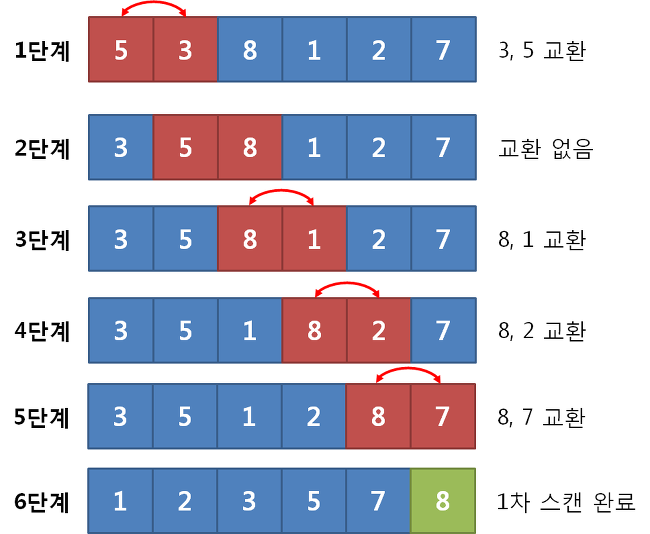

# 🎡 Code Festival
: javascript와 python 문법을 다지기 위한 문제 100개.
> 두 개 너무 헷갈려서 같은 문제를 풀면서 비교해보기.

## 📑 Q3. 변수의 타입
### 💛 JS
: ```object```
> undefined, string, number은 모두 기본 자료형(primitive type).
``` js
var arr = [100, 200, 300];
console.log(typeof(arr));
```
### 💙 PYTHON
: ```class 'list```
``` py
l = [100, 200, 300]
print(type(l))
```

## 📑 Q4. 변수의 타입2
### 💙 PYTHON
: char 아니고 str임. 헷갈 ㄴㄴㄴㄴㄴㄴ

## 📑 Q5. for문 계산
### 💛 JS
``` js
var a = 10;
var b = 2;

for(var i=1; i<5; i+=2){
    a += i;
}

console.log(a+b);
```
> 16
### 💙 PYTHON
: 파이썬 for문이 나한테는 너무 익숙하지 않아서 헷갈림.
> ```range(1, 5, 2)```가 ```(i=1; i<5; i+=2)```와 같다.
``` py
a = 10
b = 2
for i in range(1, 5, 2):
    a += i

print(a+b)
```

## 📑 Q6. False
### 💛 JS
: NaN, "", 0, undefined, null 등
> 1아님.
### 💙 PYTHON
: None, "", 0, bool(0) 등
> 1아님.

## 📑 Q7. 변수명
### 💛 JS
: JavaScript 식별자는 문자, 밑줄(_) 혹은 달러 기호($)로 시작해야하며\
=> 숫자로 시작 불가능.\
: JavaScript 문법에 존재하는 예약어는 사용이 불가능.
> 1age, let
### 💙 PYTHON
: 영문자(대, 소문자 구분), 숫자, 언더바(_)를 사용할 수 있지만, 첫 자리에는 숫자를 사용할 수 없음.\
: 파이썬 키워드는 변수 명으로 사용 X
> 1age, as

## 📑 Q8. 객체 키 이름 중복(딕셔너리 키 이름 중복)
: 객체 키 이름 중복이 되었을 경우, 마지막으로 넣은 값으로 나타남.
### 💛 JS
``` js
var d = {
    'height':180,
    'weight':78,
    'weight':84,
    'temperature':36,
    'eyesight':1
};

console.log(d['weight']);
```
> 84
### 💙 PYTHON
``` py
d = {'height':180,'weight':78,'weight':84,'temparture':36,'eyesight':1}
print(d['weight'])
```
> 84

## 📑 Q21. set은 어떻게 만드나요?
: 헷갈ㄴㄴㄴㄴ
### 💛 JS
``` js
var x = {1, 2, 3, 5, 6, 7};
var x = {};
var x = new Set('javascript'); // 틀림
var x = new Set(range(5));
var x = new Set(); // 틀림
```
### 💙 PYTHON
``` py
x = {1, 2, 3, 5, 6, 7}
x = {} # 틀림
x = set('python')
x = set(range(5))
x = set()
```

## 📑 Q22. 배수인지 확인하기
: 나머지 연산자 사용하기
``` js
i % 6 == 0
```

## 📑 Q23. OX문제
### 💛 JS
```
console.log(10/3)의 출력 결과는 3이다.
```
: X\
> 출력 결과는 3.3333333333333335 이 나온다.\
소숫점이 없는 정수를 출력하고자 할 때는 Math.floor() 함수를 쓰자.
### 💙 PYTHON
```
console.log(10/2)의 출력 결과는 5이다.
```
: X\
> 출력 결과는 5.0이다.\
소숫점이 없는 정수를 출력하고자 할 때는 int() 사용하기.

## 📑 Q31. 자료형의 복잡도(왜 아닌지 모르겠음.......!)
### 💛 JS
: 배열 내장함수의 시간 복잡도가 O(1)인 것들.
``` js
arr[i]
arr.push(5)
arr.slice() // 아님
arr.pop()
arr.includes(5) // 아님
```
### 💙 PYTHON
: 리스트의 내장함수의 시간 복잡도가 O(1)인 것들.
``` py
l[i]
l.append(5)
l[a:b] # 아님
l.pop()
l.clear()
```

## 📑 Q37. 반장 선거
: 이제 슬~ 머리 굴려가면서 풀어야하죠?
### 💛 JS
``` js
// reduce를 정확하게 어떻게 쓰는 건지 모르겠음.

let vote = prompt("학생들이 뽑은 후보들을 입력하세요.").split(' ');
let result = {};
let winner = "";

for(let index in vote) {
    let kkey = vote[index];
    result[kkey] = result[kkey] === undefined ? 1 : result[kkey] = result[kkey] + 1; 
}

winner = Object.keys(result).reduce(function(a, b) {
    return result[a] > result[b] ? a : b
});

console.log(`${winner}(이)가 총 ${result[winner]}표로 반장이 되었습니다.`);
```
### 💙 PYTHON
: 출력 이상한디
``` py
vote = list(map(str, input()))
count = 0

for i in range(len(vote)):
    if vote.count(vote[i-1]) < vote.count(vote[i]):
        count = i
        
print("{}(이)가 총 {}표로 반장이 되었습니다.".format(vote[count], vote.count(vote[count])))

```

## 📑 Q38. 호준이의 아르바이트
### 💙 PYTHON
: 이해가 안된다. 굳이 이렇게 해야하는가. . .?
``` py
user_input = input()

l = list(user_input.strip().split())
l = [int (i) for i in l]

count = 3
#3개는 무조건 구매, 배열 정렬 후 1~3위 중 중복되는 숫자까지 포함

data_sorted = sorted(list(l))

print(data_sorted)
for i in range(len(l)-1, 0, -1):
	if data_sorted[-3] == l[i]:
		count += 1
print(count)
```

## 📑 Q39. 오타 수정하기
: 이건 문제가 그냥 너무 웃겨섴ㅋㅋㅋㅋㅋㅋㅋㅋㅋㅋ 타자 실력 보여주다가 잘못쳐서 프로그램 돌려서 바꾸는 사람이 어딨냐곸ㅋㅋㅋㅋ
```
혜원이는 평소 영타가 빠르고 정확한 것을 친구들에게 자랑하고 다녔습니다.
반 친구들이 혜원이의 타자 속도가 빠르다는 것을 모두 알게 되자 혜원이는 모두의 앞에서 타자 실력을 보여주게 됩니다. 

그런데 막상 보여주려니 긴장이 되서 문장의 모든 e를 q로 잘못 친 것을 발견했습니다. 
혜원이는 프로그램을 돌려 재빠르게 모든 q를 e로 바꾸는 프로그램을 작성하려고 합니다.

문장이 입력되면 모든 q를 e로 바꾸는 프로그램을 작성해 주세요.
```

## 📑 Q41. 소수판별
### 에라토스테네스의 체
: 소수를 판별하는 알고리즘.\
: 가장 먼저 소수를 판별할 범위만큼 배열을 할당해, 해당하는 값을 넣어주고, 이후에 하나씩 지워나가는 방법을 이용함.
```
1. 배열을 생성하여 초기화.
2. 2부터 시작해서 특정 수의 배수에 해당하는 수를 모두 지움.
(지울 때 자기 자신은 지우지 않고, 이미 지워진 수는 건너뛴다.)
3. 2부터 시작해 남아있는 수를 모두 출력한다.
```
- PYTHON
``` python
def prime_list(n):
    # 에라토스테네스의 체 초기화: n개 요소에 True 설정(소수로 간주)
    sieve = [True] * n

    # n의 최대 약수가 sqrt(n) 이하이므로 i=sqrt(n)까지 검사
    m = int(n ** 0.5)
    for i in range(2, m + 1):
        if sieve[i] == True:           # i가 소수인 경우
            for j in range(i+i, n, i): # i이후 i의 배수들을 False 판정
                sieve[j] = False

    # 소수 목록 산출
    return [i for i in range(2, n) if sieve[i] == True]
```
- C++
``` cpp
void Eratos(int n)
{
    /*  만일 n이 1보다 작거나 같으면 함수 종료 */
    if (n <= 1) return;

    /*	2부터 n까지 n-1개를 저장할 수 있는 배열 할당
		배열 참조 번호와 소수와 일치하도록 배열의 크기는
		n+1 길이만큼 할당(인덱스 번호 0과 1은 사용하지 않음)	*/
	bool* PrimeArray = new bool[n + 1];

	/*  배열초기화: 처음엔 모두 소수로 보고 true값을 줌	*/
	for (int i = 2; i <= n; i++)
	    PrimeArray[i] = true;

	/*	에라토스테네스의 체에 맞게 소수를 구함
		만일, PrimeArray[i]가 true이면 i 이후의 i 배수는 약수로 i를
		가지고 있는 것이 되므로 i 이후의 i 배수에 대해 false값을 준다.
		PrimeArray[i]가 false이면 i는 이미 소수가 아니므로 i의 배수 역시
		소수가 아니게 된다. 그러므로 검사할 필요도 없다.
또한 i*k (k < i) 까지는 이미 검사되었으므로 j시작 값은 i*2 에서 i*i로 개선할 수 있다.
	*/
	for (int i = 2; i * i <= n; i++)
	{
		if (PrimeArray[i])
			for (int j = i * i; j <= n; j += i)
			    PrimeArray[j] = false;
	}

	// 이후의 작업 ...
}
```

## 📑 Q42. 2020년
### 💛 JS
#### 1. Date() 객체
: 생성자 함수. 날짜와 시간을 가지는 인스턴스를 생성함.
- 인수 전달X\
: 현재 날짜와 시간을 가지는 인스턴스 반환.
``` js
const date = new Date()
```
- 인수
``` js
const date = new Date(year, month[, day, hour, minute, second, millisecond])
```
#### 2. getDay() 메소드
: 리턴 값은 정수 0 ~ 6이다. (일 ~ 토)
``` js
Date.getDay()
```
### 💙 PYTHON
#### 1. datetime 모듈사용하기
- date 클래스\
: 년, 월, 일을 입력 받아서 date 객체를 생성함.
``` py
datetime.date(year, month, day)
```
- weekday 메서드\
: 요일을 정수로 변환하여 반환.\
=> 0 ~ 6 (월 ~ 일)
> js랑 시작이 다름. (일 - 월)
``` py
import datetime
m = int(input())
d = int(input())
def findDay(a,b):
    day = ["MON","TUE","WED","THU","FRI","SAT","SUN"]
    return day[datetime.date(2020,a,b).weekday()]
print(findDay(m,d))
```
#### 2. 그냥 구현
``` py
def get_month_day(year, month):
    if month == 4 or month == 6 or month == 9 or month == 11:
        return 30
    elif month == 2:
        if year % 4 == 0 and year % 100 != 0 or year % 400 == 0:
            return 29
        else:
            return 28
    else:
        return 31

def get_total_day(year, month, day):
    year_days = (year-1)*365 + ((int((year-1)/4) - int((year-1)/100)) + int((year-1)/400))

    month_days = 0
    for i in range(1, month):
        month_days += get_month_day(year, i)

    return year_days + month_days + day

def get_weekday(day):
    day %= 7
    if day == 0:
        return 'SUN'
    if day == 1:
        return 'MON'
    if day == 2:
        return 'TUE'
    if day == 3:
        return 'WED'
    if day == 4:
        return 'THU'
    if day == 5:
        return 'FRI'
    if day == 6:
        return 'SAT'

print(get_weekday(get_total_day(2020, 1, 30)))
```

## 📑 Q42. getTime(), time 함수 사용
: 지금의 year 구하기.
### 💛 JS
``` js
const d = new Date();

let year = d.getTime();
year = Math.floor(year/(3600*24*365*1000))+1970

console.log(year);
```
### 💙 PYTHON
``` py
import time
t = time.time()
t = int(t//(3600*24*365))+1970
print(t)
```

## 📑 Q47. set 자료형의 응용
: set은 중복을 허용하지 않는다.\
=> 이 점을 이용하여 중복제거가 가능함.
> list, object(dic) 등
### 💛 JS
- set로 만들기
``` js
let result = new Set();
for (let key in people) {
    result.add(people[key]);
}
```
- ```result.size```\
: size 는 set 객체 내 값의 개수를 반환함.
### 💙 PYTHON
- ```set()```\
: set로 만들기

## 📑 Q50. 버블정렬 구현하기
: 버블정렬은 인접한 2개의 레코드를 비교하여 크기가 순서대로 되어있지 않으면 서로 교환하는 비교-교환 과정을 리스트의 왼쪽 끝에서 시작하여 오른쪽 끝까지 진행.


## 📑 Q51. merge sort를 만들어보자
1. 배열(리스트)의 길이가 0 또는 1이면 이미 정렬된 것으로 본다. 그렇지 않은 경우에는
2. 정렬되지 않은 배열(리스트)를 절반으로 잘라 비슷한 크기의 두 부분 배열(리스트)로 나눈다.
3. 각 부분 배열(리스트)를 재귀적으로 합병 정렬(merge sort)을 이용해 정렬한다.
4. 두 부분 배열(리스트)를 다시 하나의 정렬된 배열(리스트)로 합병한다.

## 📑 Q52. quick sort
1. 배열에서 임의의 원소를 고른다. 이 때 고른 것을 pivot이라고 한다.
> 일반적으로 가운데 원소를 고른다.
2. pivot 앞에는 pivot 보다 작은 원소들로, pivot의 뒤에는 pivot보다 큰 원소들이 오도록 교환해준고 pivot을 기준으로 나눠준다.
3. 나눈 두 개의 작은 배열에 대해 재귀로 이 과정을 반복해준다.
4. 재귀의 종료조건은 배열의 크기가 0이다.
### 💛 JS
: concat() 메서드는 인자로 주어진 배열이나 값들을 기존 배열에 합쳐서 새 배열을 반환한다.
> 기존배열을 변경하지 않고, 추가된 새로운 배열을 반환한다.
### 💙 PYTHON
: ```퀵정렬(그룹_하나) + [기준값] + 퀵정렬(그룹_둘)``` 이런식으로 ```+```를 통해 배열을 합칠 수 있음.

## 📑 Q55. 하노이의 탑
: 하노이의 탑은 A, B, C 3개의 기둥과 기둥에 꽂을 수 있는 N 개의 원판으로 이루어져 있다. A 기둥에 있는 원반 N 개를 모두 C 원반으로 옮기고 싶다. 모든 원반을 옮기기 위해 실행되어야 할 최소 원반 이동 횟수를 계산하는 프로그램을 완성하자.
```
1. 처음에 모든 원판은 A 기둥에 꽂혀 있다.
2. 모든 원판의 지름은 다르다.
3. 이 원반은 세 개의 기둥 중 하나에 반드시 꽂혀야 한다.
4. 작은 원반 위에 큰 원반을 놓을 수 없다.
5. 한 번에 하나의 원판(가장 위에 있는 원판)만을 옮길 수 있다.
```